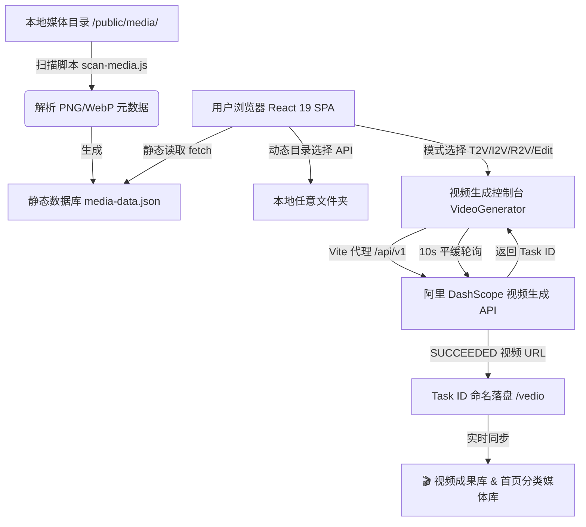

# 🎨 PromptMedia - ComfyUI AI 艺术多媒体画廊 & 视频生成控制台

<p align="center">
  <strong>专为 ComfyUI 创作者、AI 艺术家与 AIGC 爱好者打造的全能型多媒体分类展示与大模型视频生成控制台</strong>
</p>

<p align="center">
  
  
  
  
  
</p>

---

## 📖 项目简介

**PromptMedia** 是一款极具现代设计审美 (Glassmorphic) 的前端全静态多媒体画廊与 AI 视频创作工作台。

它不仅能**脱机零后端运行**，通过扫描本地目录自动解析 PNG/WebP 图片中嵌入的 **ComfyUI 完整生成参数与节点工作流**，还内置了功能强大的 **AI 视觉视频生成控制台**，原生适配阿里云 DashScope (通义万相 Wanx 2.7 / HappyHorse 1.1 / Qwen Image 2.0 Pro) 等最新短视频大模型，支持文生视频、图生视频、参考生视频与视频重绘编辑的全流程履约。

针对不同场景审美，网站内置了 **3 套独立的高颜值视觉主题**（科技暗黑、清新雅致、炫酷动感），并支持 1600px 宽屏齐平排版与响应式瀑布流展示。

---

## ✨ 核心特性一览

### 1. 🏗️ 模块化分层架构 (v1.8.0 Modular Architecture)
- **极简根容器**：原 4500+ 行单文件代码重构解耦为 `src/components/`（组件库）、`src/constants/`（静态配置）与 `src/utils/`（解析与大模型推荐引擎），`App.jsx` 精简至主控容器。
- **架构高扩展**：各功能模块独立封装，为未来通用 Schema-Driven 配置驱动打下夯实底座，构建速度极快。

### 2. 🎬 视觉视频生成控制台 (Video Generator Studio)
- **4 种生成模式全覆盖**：
  - **文生视频 (T2V)**：纯 Prompt 文本驱动场景漫游。
  - **图生视频 (I2V)**：单张源图进行动态预测与表情运动。
  - **参考生视频 (R2V)**：1~9 张多图参考矩阵，支持方括号 `[Image 1]` 语法与对话剧情模式。
  - **视频重绘编辑 (Edit)**：待编辑原视频 (`video1`) + 参考图 (`image1`) 同步重绘，支持对齐原视频播放时长。
- **10 款原生视频大模型精选 & 自定义模型扩展**：
  - 阿里 HappyHorse (v1.1 T2V / I2V / v1.0 R2V / Edit)、通义 Wan 2.7 (T2V / I2V / R2V)、通义千问 Qwen Image 2.0 Pro 精准收录。
  - 支持按当前生成模式**动态隔离过滤**；支持通过“+ 管理模型”自由扩展与删除个人自定义模型 ID。
- **Task ID 精确落盘与成果库/媒体库双向同步**：
  - 生成视频统一以真实 `task_id`（如 `${taskId}.mp4`）自动导出存入 `/vedio` 目录，防丢失可追溯。
  - 任务成功后，视频与生成用参考图自动同步至右侧 **“🎬 视频合成成果库”** 与首页 **“分类媒体库”** 视频专区。
- **跨域代理与平缓轮询**：
  - Vite 本地自动化跨域代理 `/api/v1` 与 `/dashscope-proxy`，彻底解除预检 CORS 阻塞。
  - 10 秒平缓异步轮询（`PENDING` ➔ `RUNNING` ➔ `SUCCEEDED` / `FAILED`），支持 Task ID 实时卡片与状态刷新。

3. 🧠 **ComfyUI 图像元数据深度提取**
- **原生二进制解析**：直接提取 PNG (`tEXt`/`iTXt`) 或 WebP (`XMP`) 二进制数据块中的 ComfyUI 提示词数据。
- **全维度参数还原**：提取展示 Positive/Negative Prompts, Seed, Steps, CFG, Sampler, Scheduler, Checkpoint 模型及分辨率。
- **源码级工作流查看**：提供 **Prompt API Graph** 与 **Workflow UI Graph** JSON 节点图查看器，可一键复制并拖回 ComfyUI 恢复画布。
- **侧边栏 JSON 兼容**：自动识别加载同名 `.json` 文件，兼容处理被压缩软件抹去元数据的 JPG/WebP 图像。

4. 🎨 **3 套 Premium 视觉主题与 1600px 宽屏排版**
- **🌙 科技暗黑 (Cyber Dark - 默认)**：赛博朋克深黑背景、霓虹紫青流光发光与高反差磨砂玻璃。
- **🍃 清新雅致 (Fresh Mint)**：自然薄荷绿护眼浅色色调、柔和投影与春意盎然的明亮体验。
- **⚡️ 炫酷动感 (Dynamic Anime)**：次元动感渐变背景平滑滚动、毛玻璃气泡浮动、3D 弹性卡片悬浮倾斜。
- **1600px 视口对齐**：顶栏与主视图最大宽度统一定制为 1600px，边框两侧精准对齐；顶部导航按钮字体属性与图标全量规范化。

5. 💡 **Danbooru 提示词生成器 & 🤖 AI 提示词大师**
- **Danbooru 提示词生成器**：
  - 支持 Pony Diffusion V6、Illustrious XL 及 Standard Anime 质量前缀预设与 Rating 分级。
  - **12 种灵感推荐引擎**：提供 🌸日系动漫、📸写实人像、🌃赛博朋克、🔮奇幻魔法、🎋国风华服、🚀科幻太空、🍃清新田园、👥多人合照、⛓️束缚调教、🎭隐奸推荐、🔞羞羞推荐 及 🎲随机任意风格 一键智能推荐生成。
  - 支持 28 个分类标签可视化加减权重 (0.1 ~ 2.5) 与一键复制。
- **AI 提示词大师**：
  - 对接本地 **Ollama (`llama3:latest`)** 或远程 **DeepSeek / OpenAI** API。
  - 将用户简短的一句话脑洞，结合艺术风格、构图视角与光影氛围，智能扩展为段落式自然语言英文 Prompt 与中文意译。

---

## 🔄 系统工作流图解



---

## 📂 项目目录与 `src/` 模块化架构

```text
imageshow/
├── doc/                        # 📚 系统架构、PRD 与部署运维文档
│   ├── requirements.md         #   ├── 需求规格说明书 (PRD)
│   ├── user_guide.md           #   ├── 平台使用与操作指南
│   ├── deployment.md           #   ├── 编译打包、代理与静态部署指南
│   └── changelog.md            #   └── 版本变更追溯记录 (按 1~3 条规范记录)
├── public/                     # 🌐 静态资源库
│   ├── media/                  #   ├── 分类媒体文件夹
│   │   ├── media-data.json     #   ├── 扫描脚本生成的全局索引数据库
│   │   ├── vedio/              #   ├── 生成视频 Task ID 命名落盘输出目录
│   │   └── cyberpunk / nature  #   └── 自动分类子目录
├── src/                        # 🚀 前端源码库 (v1.8.0 模块化分层架构)
│   ├── components/             #   🧩 业务 UI 组件库 (按功能模块解耦)
│   │   ├── Gallery/            #   │   ├── 媒体画廊模块
│   │   │   ├── GalleryFilter.jsx   #   │   │   ├── 检索过滤栏 (多维搜索、模型/采样器筛选、分类Tab及Count徽章)
│   │   │   ├── GalleryGrid.jsx     #   │   │   ├── 响应式 Masonry 瀑布流媒体卡片网格
│   │   │   └── MediaDetailModal.jsx#   │   │   └── ComfyUI 图像元数据矩阵与 API/UI 节点图查看模态框
│   │   ├── PromptEditor/       #   │   ├── 提示词引擎模块
│   │   │   ├── TagBuilder.jsx      #   │   │   ├── Pony/Illustrious 标签权重构建与 Danbooru 分类检索
│   │   │   └── PromptMaster.jsx    #   │   │   └── LLM 大模型自然语言创意扩充与双语对照 (Ollama/DeepSeek/OpenAI)
│   │   ├── VideoGen/           #   │   ├── 视觉视频生成模块
│   │   │   └── VideoGenerator.jsx  #   │   │   └── T2V/I2V/R2V/Edit 四模式选择器、媒体上传、模型管理与轮询卡片
│   │   ├── Guide/              #   │   ├── 部署指南模块
│   │   │   └── GuideTab.jsx    #   │   │   └── 平台部署说明与本地扫描操作文档页
│   │   ├── Header.jsx          #   │   ├── 🔝 顶部导航栏 (页签切换、本地目录导入与 3 套主题 Pill Selector)
│   │   └── Toast.jsx           #   │   └── 🔔 全局 Toast 消息微动效浮动通知组件
│   ├── constants/              #   📌 静态配置与字典
│   │   ├── aiPrompts.js        #   │   ├── AI Prompt 大师艺术风格、构图视角与光影氛围配置数组
│   │   ├── translations.js     #   │   ├── 媒体分类中英文双语对照字典及转换函数
│   │   └── videoModels.js      #   │   └── 10 款阿里/智谱/腾讯短视频大模型定义及 4 模式示例词预设
│   ├── utils/                  #   🛠️ 核心工具函数库
│   │   ├── metadataParser.js   #   │   ├── 浏览器端文件夹读取及 PNG/WebP 二进制元数据解析器
│   │   ├── randomPromptEngine.js#  │   ├── Danbooru 12 种预设视觉风格智能推荐与反向清洗算法引擎
│   │   ├── tagParser.js        #   │   ├── Tag 权重 ((tag:1.2)) 及括号提取解析器
│   │   └── urlUtils.js         #   │   └── 阿里 DashScope API 本地代理 URL 及 Task 查询转换器
│   ├── App.jsx                 #   🚀 根主控容器组件 (由 4500+ 行精简至 ~600 行，仅负责状态与 Tab 路由驱动)
│   ├── App.css                 #   🎨 组件、视频生成双栏工作区、画廊与模态框全局样式表
│   ├── index.css               #   🌈 全局 Design System、1600px 视口对齐及 3 套视觉主题 CSS 变量与动画
│   └── main.jsx                #   ⚛️ React 19 SPA 入口渲染文件
├── tag/                        # 🏷️ Danbooru TagComplete 中文翻译源字典库
├── scan-media.js               # 🔍 Node.js 本地扫描与 ComfyUI 元数据提取 CLI 脚本
├── build-tags.js               # 🔨 Tag 词库双语对照预编译脚本
├── directory-config.json       # ⚙️ 本地软链接映射目录配置文件
├── vite.config.js              # ⚡ Vite 8 构建配置（含 DashScope 跨域代理）
├── package.json                # 📦 项目依赖与 NPM Script 配置
└── README.md                   # 📝 项目说明文档
```

---

## 🛠️ 快速开始

### 1. 克隆与安装依赖

```bash
# 1. 克隆仓库
git clone https://github.com/lingyun304/imageshow.git
cd imageshow

# 2. 安装项目依赖
npm install
```

### 2. 本地媒体扫描

- **首次运行 / 切换扫描的本地目录**：
  ```bash
  npm run scan -- --switch
  ```
  在终端中输入或直接拖入您的本地媒体文件夹路径（如 ComfyUI 输出目录 `output`），脚本会在 `public/` 下创建指向该目录的软链接 `media`，并生成配置。

- **快速增量更新已有目录**：
  ```bash
  npm run scan
  ```
  扫描器自动解析目录下所有分类文件夹的媒体文件与元数据，更新 `public/media/media-data.json`。

### 3. 启动开发服务器

```bash
npm run dev
```
打开浏览器访问控制台输出的地址（默认 `http://localhost:5173`）即可开始体验。

---

## ⚙️ 接口配置与本地代理

### 1. 视频合成 DashScope API 配置
在 **“生视频模型”** 页签中点击 **“⚙️ 接口设置”**：
- **DashScope API Key**：填入阿里云 DashScope 密钥（如 `sk-...`），点击右侧 👁️ 按钮可实时明暗码切换查看。
- **跨域代理 (CORS Proxy)**：系统预设 Vite 代理接口，将请求转发至 DashScope 域名，解决浏览器直接请求产生跨域阻断的问题。

### 2. Ollama 本地大模型配置 (AI 提示词大师)
若想在本地离线使用大模型润色提示词：
1. 确保电脑已安装并启动 [Ollama](https://ollama.com/)。
2. 终端运行 `ollama run llama3` 装载模型。
3. 在网站 **“AI 提示词大师”** 的 **“大模型接口配置”** 中选择快捷预设 **“Ollama (本地)”**，验证地址 `http://localhost:11434/v1`，点击 **“测试接口连接”** 即可。

---

## 📦 打包与静态部署

由于 PromptMedia 采用了 React 全静态架构，项目打包极简：

```bash
npm run build
```

构建完成后，`dist/` 目录包含全部编译好的静态 HTML/CSS/JS 文件，可以直接发布部署到：
- **Nginx / Apache 静态 Web 服务器**
- **Vercel / Netlify / Cloudflare Pages**
- **GitHub Pages / GitLab Pages**

> 📖 详细部署配置与 Web 服务器策略请参阅 [编译部署与上线指南](doc/deployment.md)。

---

## 📄 配套文档

- 📘 [PRD 需求规格说明书 (requirements.md)](doc/requirements.md)
- 📙 [用户使用与操作指南 (user_guide.md)](doc/user_guide.md)
- 📗 [静态构建与部署运维文档 (deployment.md)](doc/deployment.md)
- 📝 [项目变更追溯记录 (changelog.md)](doc/changelog.md)

---

## 📜 许可证

本项目基于 [MIT License](LICENSE) 开源。欢迎 Star、Fork 或提交 Pull Request！
